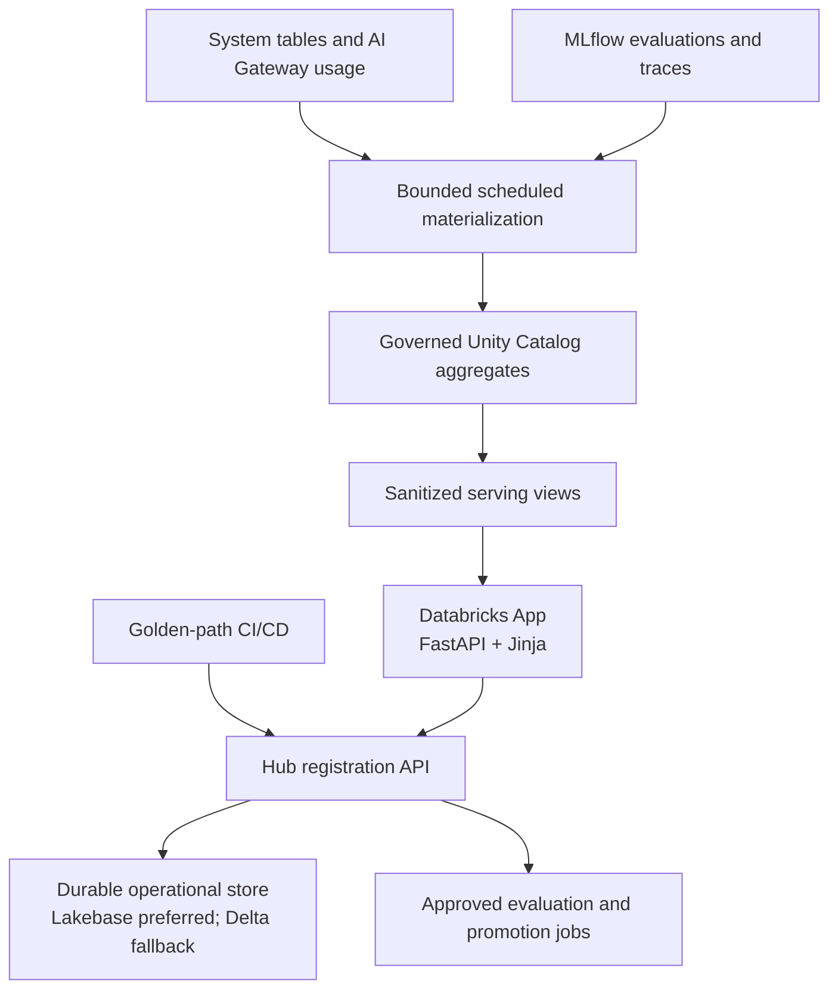

# AI Platform Hub

AI Platform Hub is the platform console's control-plane experience for registered AI
applications. It adds a versioned `ai-app.yaml` contract, portfolio and readiness
surfaces, and production-shaped workflow state without replacing the golden-path
templates or `aai-core`.

This document is the enablement contract for the Hub. A feature marked **gated** must
remain unavailable in the hosted UI until its external resource, grant, and operational
owner are in place. Empty telemetry is **unknown**, not zero.

## Architecture

The App is a thin control plane. It does not create infrastructure, query account system
tables for every page, mutate production directly, or return raw MLflow trace payloads.
Registration and workflow writes go through one repository interface. Expensive
observability work runs on a schedule and the UI reads bounded, sanitized projections.

### Why the UI uses Jinja instead of React

The build specification permits an existing approved equivalent to React. This
repository already has one: server-rendered Jinja templates, small vanilla-JavaScript
enhancements, FastAPI routes, shared CSS, and ASGI tests.

Adding React would introduce Node, a second package manager and lockfile, and a deploy-time
dependency channel. That conflicts with the repository's explicit no-Node rule and would
change its supply-chain security posture. The existing stack delivers the required
portfolio, detail, readiness, action, and optimization views without that cost or risk.

## Capability matrix

| Capability | Status in this delivery | Enablement gate |
|---|---|---|
| Guided onboarding, generated commands, and app-service-principal platform-state checks | **Available** | Existing App resource and its current read bindings |
| AI Platform Hub navigation, portfolio/detail/readiness/action/optimization presentation | **Available** | Real data remains visibly unavailable until the corresponding adapter is enabled |
| Strict `ai-platform/v1` manifest validation, normalization, credential-value rejection, and deterministic hashing | **Available** | Golden-path CI must submit manifests through an authenticated registration principal |
| Immutable application/version records, audit events, optimistic concurrency, evaluation and promotion state machines, four-eyes checks | **Available with the Lakebase binding** | Select `lakebase`, bind the approved existing branch/database, and let the app SP own the configured schema |
| In-memory repository | **Local preview only** | Never permitted for a hosted App; all state disappears on process restart |
| Deterministic health and release-readiness evaluation | **Available as a domain contract** | Governed evidence feeds, versioned profiles, and durable snapshots |
| Databricks AI request tags from `aai-core` | **Available** | Applications must use the SDK bootstrap/provider path and valid platform tags |
| Durable registration and portfolio data | **Opt-in for UAT** | Existing Lakebase Autoscaling `postgres` resource binding, schema migration, and registration allowlist |
| Application visibility and contribution roles | **Gated in hosted mode** | Authoritative `application_principal` mappings; manifest owner/support metadata never grants access |
| Group-derived visibility, platform roles, and direct-user cost | **Gated** | A trusted group/identity integration compatible with the repository's no-OBO policy |
| Application cost, AI Gateway usage, health, trace summaries, and optimization findings | **Gated** | Scheduled materialization, secure serving views, freshness monitoring, and grants |
| Run evaluation | **Gated** | Registered evaluation job, narrow run permission, result reconciler, and durable idempotency |
| Request/review/execute UAT promotion | **Gated** | UAT target, four-eyes administrator mapping, promotion job, deployment identity, and audit reconciliation |

“Available as a domain contract” means the rule can be tested deterministically with
supplied evidence. It does not mean the hosted App currently has that evidence.

## Published API

The App publishes OpenAPI at `/api/openapi.json` and the manifest JSON Schema at
`/api/v1/manifest-schemas/ai-platform-v1`. The implemented versioned surface includes:

- registration and visibility-filtered application/version reads;
- bounded evaluation and promotion history plus governed workflow submissions;
- the administrator promotion queue and review transitions;
- capability discovery; and
- explicit `503` problem responses for gated costs, sanitized traces, and optimization.

All mutations use strict request models that contain no actor field. Hosted identity
comes only from the Databricks forwarded-user assertion; CI registration also requires
the explicit machine-principal allowlist. Responses include `X-Request-Id`, validation
problems omit submitted values, direct reads use the same visibility rule as lists, and
sort/filter keys are allowlisted. Registration returns `201` for a new immutable version
and `200` for an idempotent replay.

## Regional and existing-resource decisions

### Existing Lakebase Autoscaling resource

This delivery reuses the existing Lakebase resource selected by the platform owner. The
repository deliberately carries no guessed project, branch, database, or endpoint: full
branch and database resource paths are required bundle variables, and the App's current
`postgres` binding supplies `PGHOST`, `PGPORT`, `PGDATABASE`, `PGUSER`, `PGSSLMODE`, and
`LAKEBASE_ENDPOINT` at runtime.

Repository code never provisions, adopts, resets, or deletes a Lakebase project, branch,
database, endpoint, or role. The selected branch/database needs an explicit owner,
retention decision, backup/recovery procedure, cost attribution, and UAT isolation
contract before the optional App resource is enabled.

### Legacy `dbx_platform` assets

Discovery also found useful legacy tables and jobs in the shared `dbx_platform` schema.
They are owned and operated by the legacy shared platform principal. This repository's
security rules prohibit mutating that principal or silently taking ownership of its
resources.

The Hub therefore does not write those tables, depend on their undocumented schemas, or
bind itself directly to their action executors. Their owner may expose stable,
versioned, read-only views to the Hub's serving schema. A migration can copy approved,
sanitized facts into the new namespaces, but ownership, grants, retention, freshness,
and on-call responsibility must be explicit first. The same rule applies to any shared
warehouse: it is reusable query compute only after its owner grants `CAN USE` and accepts
the workload; its tables and lifecycle are not adopted.

## Durable-store contract

All registration, version, principal, resource-binding, evaluation, promotion, and audit
operations use the `HubRepository` boundary. An implementation must preserve:

- transactions for multi-record changes;
- immutable application identity and version evidence;
- monotonic row versions and compare-and-swap updates;
- idempotent registration and job requests;
- one active equivalent evaluation or promotion request;
- append-only privileged action events; and
- four-eyes environment-promotion approval.

The in-memory implementation is a deterministic test double for `make app-run` and unit
tests. It is process-local, resets on restart, and must never be selected when the App is
hosted. If no durable adapter is configured, the hosted application fails closed: reads
show an unavailable capability and mutations stay disabled.

### Preferred: existing Lakebase Autoscaling

Connect the externally managed resource as follows:

1. Record the exact full paths `projects/<project>/branches/<branch>` and
   `projects/<project>/branches/<branch>/databases/<database>` in the required bundle
   variables. Confirm the selected resource is approved for Hub UAT state; do not infer
   or silently default to the `production` branch.
2. Bind it to the existing App with the current `postgres` resource shape (`branch` plus
   `database`) and `CAN_CONNECT_AND_CREATE`. The retired `database`/`instance_name`
   resource shape is not supported.
3. Set `AAI_HUB_STATE_MODE=lakebase` and choose a dedicated lowercase
   `AAI_HUB_LAKEBASE_SCHEMA`. Deploy the App before any local database client touches
   that schema. The App service principal creates it and must remain its owner; an
   existing schema owned by another principal makes startup fail closed.
4. At startup, the adapter takes a PostgreSQL advisory lock and applies forward-only,
   transactional, checksum-protected migrations. It refuses migration gaps, modified
   history, and a database schema newer than the running App. Migrations never run from
   an HTTP request.
5. New PostgreSQL connections use a Databricks-generated OAuth database credential.
   Tokens are cached only in process memory, refreshed before expiry, and injected by a
   SQLAlchemy creator callback rather than placed in a URL. The bounded pool uses
   pre-ping, bounded transient-connect retries, and recycling before the one-hour
   credential lifetime. Each session defaults to a 30-second statement timeout and a
   5-second lock timeout; strictly validated `AAI_HUB_LAKEBASE_STATEMENT_TIMEOUT_MS` and
   `AAI_HUB_LAKEBASE_LOCK_TIMEOUT_MS` settings may narrow or extend those bounds within
   the adapter's fixed limits.
6. No PAT, native database password, connection URL, or OAuth value belongs in Git,
   bundle variables, `app.yaml`, logs, or errors. A connection/driver failure is reduced
   to a stable `repository unavailable` category at the API boundary.

### Fallback: Delta through SQL

If Lakebase is unavailable, implement the same repository interface with dedicated Delta
tables and a serverless SQL warehouse. Provision externally:

1. A platform-owned catalog/schema and Hub control tables. The migration principal gets
   DDL; the App service principal gets `USE CATALOG`, `USE SCHEMA`, `SELECT`, and only the
   required `MODIFY` privileges.
2. A SQL warehouse resource binding and `CAN USE` on an approved, small serverless
   warehouse with short auto-stop.
3. Versioned table migrations and a retention/maintenance owner.
4. Compare-and-swap predicates on `row_version`, idempotency keys, and reconciliation for
   partially completed job launches.

Delta statement execution cannot provide all PostgreSQL transactional guarantees across
multiple statements. The adapter must document that limitation, keep transitions small,
reject stale row versions, and reconcile ambiguous outcomes rather than reporting
success. Storage-specific SQL stays inside the adapter.

## Identity and the no-OBO boundary

Databricks-provided `X-Forwarded-User`, `X-Forwarded-Email`,
`X-Forwarded-Preferred-Username`, and `X-Request-Id` may identify the browser request.
They are trusted only when injected by the Databricks Apps ingress. Actor identity is
never accepted from a body, query parameter, or client-supplied cost filter. Raw email
addresses are not placed in tags, telemetry, or audit details.

The build specification proposes forwarding the user's OAuth token to SQL so
`session_user()` and `is_account_group_member()` represent the browser user. This
repository explicitly forbids on-behalf-of-user authorization: the consent is
irrevocable and its scopes do not cover the platform-state checks this App performs.
Consequently:

- the App never forwards or stores a user OAuth token;
- SQL executed by the App identifies the App service principal, not the browser user;
- a view must not claim that `session_user()` is the signed-in browser user;
- platform-state checks remain app-service-principal checks; and
- manifest `owner` and `supportGroup` fields remain descriptive metadata and never
  create `application_principal` rows; application visibility, platform-wide roles,
  approval authority, and “my direct usage” stay gated until an externally approved
  trusted role/identity mapping exists.

An approved mapping could be a platform-managed, signed ingress claim or a restricted
identity projection maintained outside the App. It must support indirect account-group
membership, have a revocation process, and be enforced in the backend. Configuring group
names alone is not proof of membership. Enabling OBO instead requires an explicit change
to the repository governance contract, not a code shortcut.

## External prerequisites

### Governed telemetry and secure views

The platform data owner must create parameterized, platform-owned `control`,
`observability`, and `serving` namespaces. A scheduled Lakeflow job running as an
administrative materialization principal must:

- incrementally read the required billing, list-price, job, endpoint, App, and AI Gateway
  system tables;
- ingest evaluation results and sanitized MLflow trace summaries;
- normalize resource/application mapping and preserve unattributed cost;
- write hourly/daily aggregates with source window, currency, attribution class, quality,
  and refresh time; and
- expose only bounded, application-scoped serving views.

The App gets `SELECT` on serving views, not raw system tables. Users receive no raw-table
grants. Because the App does not use OBO, user-filtered views require the approved
identity projection described above; otherwise only application-level or explicitly
platform-wide service-principal views may be enabled. Materialization queries must use
bounded windows, incremental checkpoints, and workload limits. Page requests never run
fleet-wide scans.

The App runtime does not depend on MLflow. A scheduled job performs MLflow searches and
writes sanitized summaries and deep-link identifiers; full traces remain in the native
MLflow UI.

### Groups and machine registration

The identity owner must approve account-level groups for platform viewer, platform
administrator, and auditor roles and configure their names through:

- `AAI_HUB_PLATFORM_VIEWER_GROUP`;
- `AAI_HUB_PLATFORM_ADMIN_GROUP`; and
- `AAI_HUB_PLATFORM_AUDITOR_GROUP`.

Existing similarly named workspace groups are not automatic substitutes for account
groups. The trusted mapping must prove membership before a role is granted. Separately,
`AAI_HUB_REGISTRATION_PRINCIPALS` is an allowlist of CI service-principal application
identities permitted to register manifests; it never grants a human administrator role.

### Evaluation and promotion jobs

Every registered environment must reference an approved evaluation job and may reference
a promotion job. Provision externally:

- the evaluation dataset, scorer profile, MLflow experiment permissions, and a job that
  evaluates the registered immutable version;
- the App service principal's minimum supported run permission on those exact jobs only;
- a reconciler that records Databricks job-run state and sanitized result summaries;
- a UAT bundle target with lifecycle `validation` and a promotion job that runs as a dedicated deployment
  service principal;
- an idempotency token accepted and recorded by both job and repository; and
- a trusted platform-administrator mapping for review, with requester/approver
  separation and readiness revalidation at approval time.

The web process starts a configured job and records its state. The evaluation job performs
evaluation; the promotion job performs environment mutation. The web process does
neither.

Remote job execution is not enabled in this delivery. Keep
`AAI_HUB_JOB_MODE=unavailable` in hosted configuration even after the exact jobs and
minimum run permissions are approved. Enabling `databricks` also requires a later,
reviewed implementation of durable status reconciliation and sanitized result ingestion;
the service currently rejects that mode at the workflow boundary. `preview` is available
only for explicit local testing and is rejected when the App is hosted.

## Cost controls

- Reuse the already provisioned Hub App resource; CI updates it and never creates a
  second App.
- Keep the App at the smallest currently supported `MEDIUM` size (approximately
  0.5 DBU/hour) and preserve its serverless usage-policy attribution.
- Keep it stopped by default. Deployment uploads code but does not start or restart it.
  Start it only for a bounded smoke test or an approved operating window.
- Use the smallest durable-store and SQL compute that meet the workload, with aggressive
  auto-suspend and no adoption of another application's database.
- Materialize telemetry incrementally on a measured schedule. Bound source windows,
  result sizes, concurrency, and retention; do not scan system tables on page loads.
- Cache only non-sensitive projections with a freshness timestamp. Never turn stale or
  missing data into a zero-cost claim.
- Keep MLflow out of the App runtime dependency closure; use scheduled sanitized
  projections and native deep links.
- Launch only explicitly registered jobs, deduplicate requests, and avoid always-on
  workers.

## Failure runbooks

### Durable store unavailable

1. Confirm the UI reports **unavailable** and all mutations are disabled.
2. Check the App resource binding, database/warehouse state, runtime grants, OAuth
   rotation, and latest migration version.
3. Do not switch a hosted App to memory mode, change the branch/database to bypass the
   incident, or create schema from a request.
4. Restore the external dependency and grants, restart the App so its checksum-protected
   migrations complete, and verify a read plus an idempotent test registration before
   reopening writes.

### Telemetry stale

1. Treat cost, health, trace, and optimization facts as unknown; retain and display their
   last successful refresh time.
2. Inspect the materialization job run, checkpoint, source-table availability, warehouse
   auto-stop/start, grants, and rejected records.
3. Fix the cause, then rerun only the failed bounded window. Do not compensate with a
   direct fleet scan from a page request.
4. Verify row counts, source windows, unattributed cost, and serving-view freshness.

### Evaluation stuck

1. Look up the durable evaluation record and recorded Databricks run ID before starting
   anything new.
2. Inspect the job run and reconciler. Retry polling with the existing idempotency key;
   do not launch a duplicate active evaluation.
3. If operational policy allows, cancel the underlying run. Reconcile it to a terminal
   failed/cancelled state with a sanitized reason and audit event.
4. Keep readiness unknown or blocked until a fresh evaluation of the current immutable
   version completes.

### Promotion failed

1. Confirm no environment mutation was attempted by the web process.
2. Inspect the durable request, approval/readiness snapshot, promotion job run, target,
   deployment identity, and bundle validation output.
3. Preserve the failed terminal state and audit trail. Correct the external cause.
4. Retry only through an approved, idempotent promotion request when the job proves the
   prior attempt did not complete. Never repair UAT by granting the App broader
   rights.

### Identity-attribution gap

1. Label cost **unattributed** or **allocated**, never direct-user cost.
2. Verify SDK request tags, AI Gateway requester fields, billing `run_by`/`run_as`,
   resource tags, and application/resource registration independently.
3. Check the restricted identity mapping and its freshness without exposing raw emails
   or prompts.
4. Correct mappings in the platform-owned materialization process, replay the bounded
   source window, and retain the previous attribution quality in audit evidence.

## Enablement checklist

- [ ] Confirm the existing App is bound to bundle state, uses the approved usage policy,
  remains `MEDIUM`, and is stopped.
- [ ] Confirm the existing Lakebase project/branch/database and obtain a named platform
  owner; do not provision or silently select another resource.
- [ ] Configure the `postgres` App binding, app-SP-owned schema, migration checksums,
  OAuth pool rotation, auto-suspend, backup, and retention.
- [ ] Provision bounded telemetry materialization, approved compute, serving views,
  freshness monitoring, and App `SELECT` grants.
- [ ] Approve account-level role groups and a trusted, revocable identity/group mapping
  that does not use OBO.
- [ ] Allowlist the dedicated CI registration principal; do not reuse the legacy shared
  application.
- [ ] Register evaluation and promotion jobs, narrow run permissions, reconciler,
  idempotency, UAT target, and dedicated deployment identity.
- [ ] Configure each golden-path manifest with real resource bindings and verify the
  immutable manifest hash in CI.
- [ ] Run credential-free repository checks, generated-template tests, and authenticated
  `databricks bundle validate -t dev`. Before UAT, point `AAI_TEST_POSTGRES_DSN` at an
  explicitly approved disposable PostgreSQL database and run
  `pytest -q tests/test_hub_lakebase.py`; the test creates and drops only its unique
  `aai_hub_test_*` schema and otherwise skips when the variable is absent.
- [ ] Start the App for a bounded non-production smoke test. Verify fail-closed
  authorization, store durability, freshness labels, unattributed cost, evaluation
  deduplication, four-eyes promotion, and audit events; then stop it.

Deployment and binding commands remain in
[`docs/platform-console.md`](platform-console.md).
