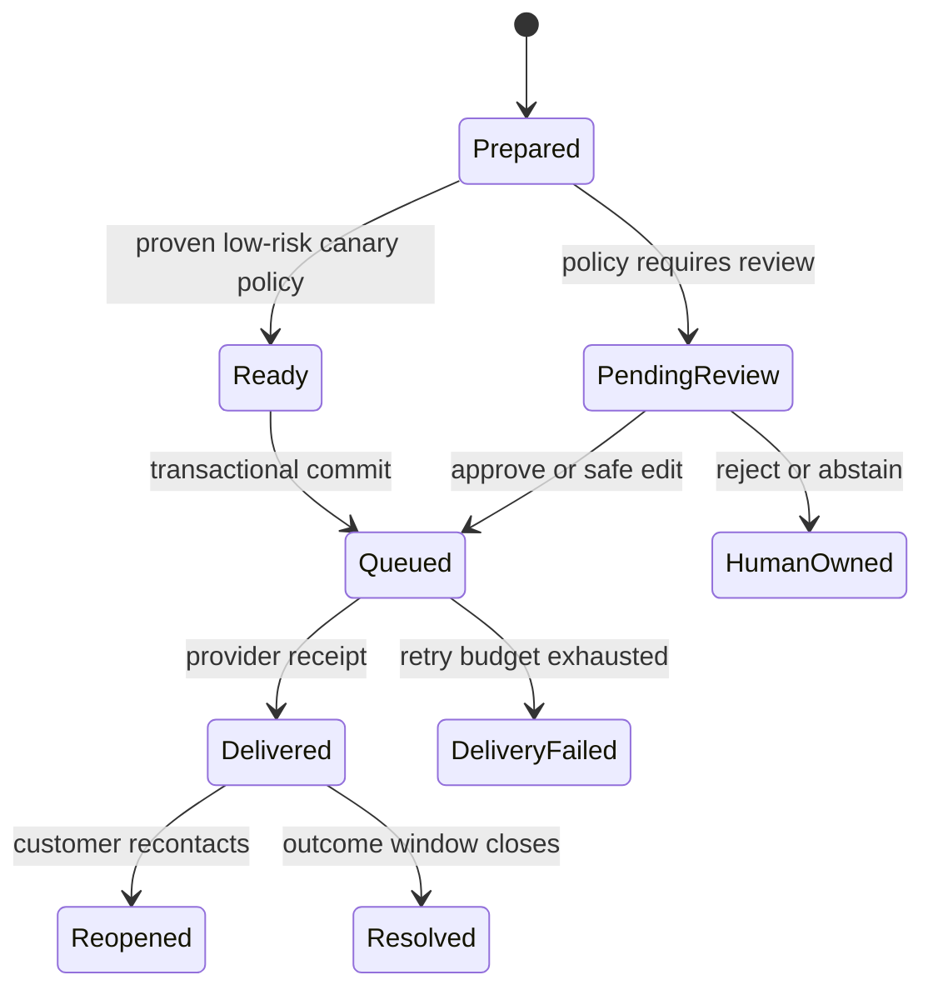
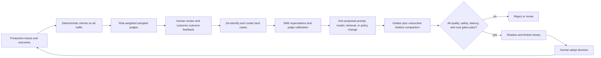

# Email Support Agent reference design

Reviewed on 2026-08-10. This document is the production target architecture
for the accelerator; it is intentionally stricter than the teaching diagram.

## System boundary

```mermaid
flowchart LR
    A[Signed webhook bytes] --> B[Size, age, signature, and digest checks]
    B --> C{Replay reservation}
    C -- duplicate --> D[Return prior opaque result]
    C -- admitted --> E[MIME parser and attachment scan]
    E --> F[DLP redaction and trusted identity mapping]
    F --> U[Encrypted raw-email put-once]
    U --> G[RedactedEmail and content-free ingress evidence]
    G --> H[LangGraph durable workflow and deterministic policy]
    H --> I[Small structured triage model when needed]
    I --> J[Permission-filtered KB retrieval]
    J --> K[Bounded grounded draft or abstention]
    K --> L[Privacy, citation, policy, and budget gate]
    L --> M{Review required?}
    M -- yes --> N[Durable interrupt and human review]
    M -- proven low risk --> O[Transactional outbox]
    N -- approve or safe edit --> O
    N -- reject --> P[Human-owned case]
    O --> Q[Idempotent ticket and email workers]
    Q --> R[Provider receipts and customer outcomes]
    R --> S[MLflow feedback and evaluation datasets]
    S --> T[Baseline/change gate and canary decision]
```



Email transport, DLP, raw storage, checkpoint storage, CRM, ticketing, outbox,
and delivery workers are platform integrations. This repository neither
provisions them nor substitutes an in-memory object in production.

### Trust boundaries

| Boundary | Required control |
|---|---|
| Internet to ingress | `IngressCoordinator` enforces configured byte/age/skew bounds, verifies a provider-bound digest, reserves replay before parsing, and orders MIME allowlisting, malware scan, DLP, identity mapping, and encrypted storage through injected capabilities. |
| Ingress to graph | Raw MIME and sender address go to encrypted storage; `RedactedEmail` carries only DLP text and opaque references. Production sender pseudonyms use keyed HMAC. Strict Pydantic validates shape; only the verified ingress adapter establishes trust. |
| Graph to retrieval | An injected trusted resolver derives tenant and groups from the opaque ingress reference. The provider prefilters tenant/shared, group, active status, and exact deployment-owned KB release; returned documents are revalidated on all four dimensions. Email/query text is never authorization. |
| Model to state/action | Known security/injection signals short-circuit before a model. Model output is strictly revalidated; PII/malformed output becomes a content-free quarantine signal and safe abstention before checkpointing. A draft never calls a write tool. |
| Review to commit | The resume payload contains no reviewer group. An injected identity-backed review authorizer resolves group and action rights, then commit checks case, proposal digest, application release, and post-edit policy. Invalid edit text never enters graph state. |
| Commit to providers | Outbox keys include ingress-provider, verified tenant, message, and action namespaces. Storage rejects a repeated key with a different immutable payload; workers add bounded retry, provider receipt, and terminal outcome. |

## Durable state and side effects



`prepare()` is repeatable and performs no business side effect. Before `commit()`
touches the outbox, it re-derives the route, policy findings, review
requirement, action plan, and usage budget from the strict checkpoint fields.
A current access authorization is resolved again; revocation or entitlement
digest drift forces re-preparation. The exact KB release is rechecked.
A human decision must echo the SHA-256 proposal digest and application
release shown at the interrupt, so a stale approval cannot authorize a changed
draft or plan. `commit()` then inserts the complete business action set in one
transactional outbox batch; a partial acknowledgement or payload collision
fails closed. `DeliveryWorker` accepts only an active lease, binds the immutable
payload digest through the provider receipt, applies capped retry/dead-letter
policy, and reuses the same provider idempotency key after a crash. Graph
replay, duplicate webhooks, worker retry, lease expiry, and process restart
therefore cannot silently duplicate or partially acknowledge a ticket/reply
set. A production outbox must enforce these constraints in durable storage; an
in-process dictionary is not an idempotency strategy.

The checkpoint contains ordinary JSON only: opaque case/thread/message ids,
ingress provider, secure raw/access references, DLP-redacted text, an access
entitlement digest (not identity claims), exact KB release, classification,
authorized evidence, admitted draft, policy results, and safe execution
result. The graph combines review authorization and commit in the resumed
node, so a rejected unsafe edit is never persisted. It does not contain MIME
bytes, sender address, attachment content, authorization claims, credentials,
native provider objects, or Pydantic instances.

## MLflow tracing and spans

Use one opaque `thread_id` as the LangGraph checkpoint key and MLflow session
id. Never use an email address or customer number. Each invocation is a fresh
trace; no span remains open while a human reviews.

The following is the production target taxonomy; framework-owned graph/model
spans fill in the parent/LLM nodes. No span stays open across review or queue
delay. Initial processing, review resume, each delivery attempt, and outcome
ingestion are separate traces joined by opaque session/linkage references. The
accelerator explicitly emits the workflow semantic children it can prove; the
provider adapters add the ingress, LLM, delivery, and outcome children.

```text
session: opaque thread_id

trace 1: email_support.initial                         AGENT
  ingress.verify                                       GUARDRAIL
  ingress.replay_reserve                               TOOL
  email.parse                                          PARSER
  attachment.scan                                      GUARDRAIL
  dlp.redact                                           GUARDRAIL
  ingress.identity_resolve                             TOOL
  ingress.raw_store                                    TOOL
  input.guardrail                                      GUARDRAIL
  intent.classify                                      CHAIN
    model.generate                                     LLM
  route.select                                         ROUTER
  customer_context.lookup (only when policy permits)  TOOL
  knowledge.retrieve                                   RETRIEVER
    knowledge.rerank                                   RERANKER
  response.draft                                       CHAIN
    model.generate                                     LLM
  response.policy_gate                                 GUARDRAIL
  review.request                                       HUMAN_REVIEW

trace 2: email_support.resume                          AGENT
  review.decision                                      HUMAN_REVIEW
  review.authorize                                     GUARDRAIL
  outbox.commit_batch                                  TOOL

trace 3: email_support.delivery_attempt                AGENT
  outbox.claim                                         TOOL
  provider.deliver                                     TOOL
  delivery.receipt_or_retry                            MEMORY

trace 4: email_support.outcome                         AGENT
  outcome.ingest                                       TOOL
  outcome.feedback                                     MEMORY
```

The custom retrieval node emits only the exact final context supplied to the
draft. Each output document has:

```json
{
  "id": "kb-password-reset-v3",
  "page_content": "...",
  "metadata": {
    "doc_uri": "synthetic://support/account/password-reset",
    "chunk_id": "password-reset-003",
    "score": 1.0,
    "tenant_scope": "shared",
    "active": true,
    "release": "kb-2026-08-01"
  }
}
```

That shape makes MLflow retrieval-groundedness, relevance, and sufficiency
scorers usable. CRM data is a `TOOL` result, not a `RETRIEVER` document.

Safe searchable attributes are low-cardinality release facts: application and
Git release, environment, logical model, exact prompt versions, index/
embedding/chunking release, route, intent, urgency, risk tier, review required,
final disposition, and dry-run flag. Hash request identifiers. Do not tag raw
subject/body, sender, recipient, customer id, review text, or document content.

Every explicit semantic child uses `GovernedSpan`: `OFF` creates nothing,
metadata-only capture contains shapes rather than values, and bounded/redacted
capture applies configured limits. External receipts and operational ids are
hashed before the tracing boundary even in `FULL`. Scorer-visible retrieval
requires bounded/redacted capture with `max_string_length` at least the final
context length, or an approved `FULL` policy; metadata-only traces cannot
support RAG judges.

Native LangGraph autologging requires `TraceCaptureMode.FULL`; generic
credential-key redaction does not discover PII embedded in free text. Enable
it only after DLP and an approved native MLflow masking processor. Otherwise
use SDK-owned bounded/manual instrumentation. Do not run both tracing owners
over the graph. The accelerator's semantic child spans start only inside an
existing trace and record metadata-only inputs; the `RETRIEVER` span is the
one intentional exception whose public/authorized document output is required
for RAG scoring.

## Evaluation and release evidence

The checked-in JSONL uses MLflow's native nested row contract:

```json
{
  "inputs": {
    "case_id": "case-billing-refund",
    "subject": "Billing refund request",
    "body": "I was charged twice and need a refund reviewed."
  },
  "expectations": {
    "expected_response": "A specialist reviews the billing request.",
    "expected_intent": "billing",
    "expected_urgency": "high",
    "expected_route": "human_review",
    "requires_review": true,
    "expected_document_ids": [],
    "expected_actions": ["enqueue_reply"]
  }
}
```

Keep four governed, mutually separated sets:

1. PR smoke cases: fast deterministic checks with no judge or cloud.
2. Golden release set: balanced by intent, urgency, route, risk, language,
   customer tier, and answerability.
3. High-risk/adversarial set: billing, account deletion, security, prompt
   injection, malformed MIME, cross-tenant retrieval, unsafe edits, and
   duplicate delivery. The false-auto-send allowance is zero.
4. Rolling production hard set: de-identified rejects, large edits, reopens,
   novel topics, high latency/cost, and judge-human disagreements. Keep the
   final holdout disjoint by customer and thread.

Deterministic release gates run first and on every change:

- schema/admission validity;
- intent accuracy and macro-F1 by stratum;
- critical-urgency recall;
- route and review-policy accuracy;
- zero false auto-send on high-risk cases;
- tenant isolation and active-document enforcement;
- retrieval recall, citation integrity, and abstention correctness;
- deterministic expected-answer keyword coverage (semantic correctness stays
  judge-owned);
- exact planned actions, no pre-approval side effect, and duplicate
  suppression;
- privacy/policy checks and request budgets.

The AgentKit smoke policy runs shared deterministic code scorers only. The
separate promotion policy runs shared versioned correctness, safety,
guidelines, and retrieval-quality judges when scorer-visible traces exist; a
tool-trajectory judge applies only to an evaluation target that actually
commits tools. AgentKit estimates calls before spend and applies absolute
thresholds plus regression budgets. For this 11-row set, three general judges
plus groundedness/sufficiency and retrieval relevance at `top_k=4` estimate 99
judge calls against a hard ceiling of 100. `mlflow.genai.evaluate()` calls the
local application for live evaluation, not a serving endpoint unless the
explicit target under test is that endpoint.

The checked-in live target is deliberately an offline fixture and cannot be
promotion evidence. Use it to prove schema/scorer wiring and preview spend;
record baseline and result only against the generated application or explicit
candidate endpoint. Connected promotion additionally requires complete
model/prompt release, calls, input/output tokens, provider cost, and pricing
evidence. `cost/coverage=0` is honest for this offline suite, never a zero-cost
claim.

An average is not enough for safety. Promotion requires the high-risk hard
gates, minimum segment sizes, no material regression in any controlled
segment, complete scorer health, exact prompt/model/index/tool release lineage,
and an `adopt` decision. Judge alignment and prompt optimization may propose a
new version; neither can move the production alias.

`email_support_agent.mlops` makes the connected loop executable but
double-opt-in. It configures bounded SDK-owned tracing from environment
bindings; registers and starts shared monitoring scorers from a reviewed
Databricks notebook; risk-samples production traces; curates only DLP-bound,
group-reviewed failures; produces MemAlign judge and bounded GEPA prompt
proposals; and checks complete release/cost/retriever/gate evidence before an
explicit human decision. Default execution is a mutation-free dry run. A
passing but under-scoped gate cannot authorize adoption.

## Feedback and improvement loop



`email_support_agent.feedback` builds de-identified trace linkage and attaches
signals through `aai_core.monitoring.log_feedback()` with non-personal human or
code provenance. Its strict names include:

- `human_review_decision`;
- `approved_unchanged`;
- `draft_edit_distance`;
- `review_reason`;
- `policy_violation`;
- `resolved_first_contact`;
- `customer_reopened_7d`;
- `delivery_outcome`.

The strongest optimization label is a verified downstream resolution/reopen
outcome, then an expert correction, then explicit customer feedback, then a
calibrated judge. A thumbs-up, model self-confidence, or one fluent answer is
not sufficient promotion evidence. Raw production emails never enter Git.

## Cost-effective operating policy

The cost objective is quality constrained:

```text
cost per safely resolved case =
  (inference + allocated judge spend + reviewer minutes * loaded hourly rate / 60)
  / safely resolved cases
```

| Control | Reference bound | Production intent |
|---|---:|---|
| Model calls per request | 2 | Deterministic routing first; normally triage plus draft, with no model for stable templates. |
| Retrieved documents | 4 | Small final context; cache by normalized query plus index release. |
| Input tokens | 8,000 | Retrieve after routing and request only the CRM fields needed. |
| Output tokens | 1,200 | Short support response contract. |
| In-graph write retries | 0 | Commit once to the outbox; workers own bounded retries and backoff. |
| Judge calls per checked-in suite | 100 | Abort before spend; set real negotiated price in deployment configuration, never source. |
| Routine production judge sampling | risk based | Deterministic checks on 100%; sample judges asynchronously, increasing for new releases and risky strata. |

Track p50/p95 latency and trace cost, tokens and calls by logical model/span,
retrieval cache hit rate, top-k distribution, review rate, approved-unchanged
rate, reviewer minutes, duplicate suppression, delivery failures, first-contact
resolution, reopen rate, and cost coverage. Cost is unknown—not zero—when
price evidence is absent.

The workflow reserves potential calls and estimated context tokens before each
provider invocation, passes the remaining output-token limit into adapters,
and validates reported usage immediately. Provider adapters must enforce that
limit natively. A classifier that consumes the call budget prevents drafting;
known injection/security templates can complete with a zero-call budget.

Start with human review for every reply. Enable low-risk auto-send only after
shadow evidence demonstrates calibrated routing and grounded drafting, the
high-risk false-auto-send gate remains zero, and the rollback switch is tested.
Use a small approved model for triage and routine drafting; invoke a larger
model only for human-assist on ambiguous or high-value cases, never as a way
to bypass deterministic policy.

## Connected integration evidence still required

The coordinator, workflow, worker, MLflow loop, and readiness scorecard make
the behavior executable, but this example deliberately does not provision or
impersonate production infrastructure. Before production, the integrating team
must supply real adapters and fresh release-bound evidence for:

- durable async checkpoint/store backup, restore, retention, and schema
  migration, least-privilege access, and authenticated record integrity;
- provider signature verification, enterprise MIME/malware/DLP controls,
  durable replay registry, quarantine, and backfill;
- transactional outbox storage/dispatcher leases, poison-message operations,
  bounce/complaint receipts, and duplicate-provider behavior;
- CRM/ticket least privilege, field minimization, tenant authorization, and
  audit evidence;
- prompt/model/index release pinning and rollback;
- rate limits, timeouts, circuit breakers, concurrency caps, and overload
  degradation;
- regional residency, deletion/legal hold, encryption, and trace retention;
- on-call alerts for false auto-send, critical misses, unsafe output,
  cross-tenant evidence, delivery failure, latency, and cost anomalies.

`email_support_agent.production` evaluates these attestations against an
owner-approved policy. Synthetic origins, stale/mismatched release evidence,
tampering, missing cost coverage, or any cross-tenant leakage, unauthorized
send, duplicate send, or high-risk false auto-send keep readiness false. See
`MATURITY_SCORECARD.md`; “10/10 reference coverage” is never a substitute for
that live evidence.
